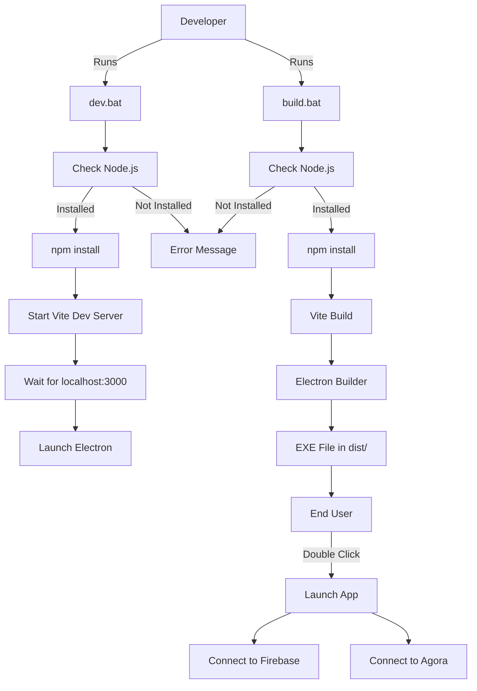

# Design Document: Build and Deployment System

## Overview

This design document describes the build and deployment system for the Discord Clone Electron application. The system provides automated scripts for development workflow and production builds on Windows. Since the application uses Firebase as a backend service and Agora for real-time communication, no separate backend server needs to be started - all backend functionality is provided through cloud services.

## Architecture

The build system consists of:

1. **Development Scripts**: BAT files for running the application in development mode with hot-reload
2. **Build Scripts**: BAT files for creating production-ready executable files
3. **Electron Builder Configuration**: Already configured in package.json for Windows NSIS installer
4. **Vite Build System**: Compiles React frontend into optimized static files

### Architecture Diagram



## Components and Interfaces

### 1. Development BAT Script (dev.bat)

**Purpose**: Start the application in development mode with hot-reload capability.

**Responsibilities**:
- Check if Node.js is installed
- Install npm dependencies if needed
- Start Vite development server
- Launch Electron application
- Display progress messages

**Interface**:
```batch
Input: None (double-click to run)
Output: Console messages, running Electron app
Error Handling: Display error if Node.js not found
```

### 2. Build BAT Script (build.bat)

**Purpose**: Create a production-ready Windows executable.

**Responsibilities**:
- Check if Node.js is installed
- Install npm dependencies if needed
- Build React frontend with Vite
- Package Electron app with electron-builder
- Create NSIS installer in dist/ directory
- Display build progress and completion message

**Interface**:
```batch
Input: None (double-click to run)
Output: EXE installer in dist/ folder
Error Handling: Display errors during build process
```

### 3. Package.json Scripts

**Existing Scripts** (already configured):
- `npm run dev`: Concurrent execution of Vite dev server and Electron
- `npm run build`: Build frontend and package with electron-builder
- `npm run dev:renderer`: Start only Vite dev server
- `npm start`: Start Electron (expects built files)

**Electron Builder Configuration** (already in package.json):
```json
"build": {
  "appId": "com.discord.clone",
  "productName": "Discord Clone",
  "directories": {
    "output": "dist"
  },
  "win": {
    "target": "nsis",
    "icon": "assets/icon.ico"
  },
  "files": [
    "src/main/**/*",
    "dist-renderer/**/*"
  ]
}
```

## Data Models

### Build Configuration

```javascript
{
  appId: "com.discord.clone",
  productName: "Discord Clone",
  outputDirectory: "dist",
  windowsTarget: "nsis",
  icon: "assets/icon.ico",
  includedFiles: [
    "src/main/**/*",
    "dist-renderer/**/*"
  ]
}
```

### Script Execution Flow

```javascript
{
  scriptName: "dev.bat" | "build.bat",
  steps: [
    { name: "Check Node.js", status: "pending" | "success" | "failed" },
    { name: "Install Dependencies", status: "pending" | "success" | "failed" },
    { name: "Build/Run", status: "pending" | "success" | "failed" }
  ],
  output: "Console messages and status"
}
```


## Correctness Properties

*A property is a characteristic or behavior that should hold true across all valid executions of a system - essentially, a formal statement about what the system should do. Properties serve as the bridge between human-readable specifications and machine-verifiable correctness guarantees.*

### Property 1: Node.js Detection Consistency

*For any* Windows system, when a BAT script checks for Node.js installation, the detection result should be consistent with the actual installation state (if `node --version` succeeds, Node.js is installed; if it fails, Node.js is not installed).

**Validates: Requirements 3.3, 3.4**

### Property 2: Build Output Completeness

*For any* successful build execution, the output directory should contain all required files for the application to run (executable file, resources, dependencies).

**Validates: Requirements 1.3, 1.4**

### Property 3: Development Server Readiness

*For any* development mode execution, the Electron application should only launch after the Vite development server is ready and responding on localhost:3000.

**Validates: Requirements 2.2, 2.3**

### Property 4: Asset Inclusion

*For any* build execution, all assets from the assets directory should be included in the final executable package.

**Validates: Requirements 5.1, 5.2, 5.3**

### Property 5: Script Idempotence

*For any* BAT script execution, running the script multiple times in sequence should produce the same result as running it once (idempotent behavior).

**Validates: Requirements 3.1, 3.2**

## Error Handling

### Node.js Not Found

**Scenario**: User runs BAT script without Node.js installed

**Handling**:
```batch
- Check for node command availability
- If not found, display clear error message:
  "Error: Node.js is not installed or not in PATH
   Please install Node.js from https://nodejs.org/
   After installation, restart your terminal and try again."
- Exit with error code 1
```

### Build Failure

**Scenario**: Vite build or electron-builder fails

**Handling**:
```batch
- Capture error output from npm commands
- Display error message with context
- Suggest common solutions:
  * Delete node_modules and run npm install
  * Check for disk space
  * Verify package.json configuration
- Exit with error code from failed command
```

### Port Already in Use

**Scenario**: Port 3000 is already occupied during development

**Handling**:
```batch
- Vite will automatically try next available port
- Display message: "Port 3000 in use, trying port 3001..."
- Update Electron to connect to new port (handled by wait-on)
```

### Missing Icon File

**Scenario**: assets/icon.ico not found during build

**Handling**:
```batch
- electron-builder will show warning
- Build continues with default icon
- Display warning to user about missing custom icon
```

## Testing Strategy

### Unit Testing

Since BAT scripts are shell scripts, traditional unit testing is limited. Instead, we use:

1. **Manual Testing Checklist**:
   - Test on clean Windows system without Node.js
   - Test with Node.js installed
   - Test with missing dependencies
   - Test with port 3000 occupied
   - Test with missing icon file

2. **Integration Testing**:
   - Run dev.bat and verify app launches
   - Run build.bat and verify EXE is created
   - Install EXE and verify app runs
   - Verify Firebase connection works
   - Verify Agora connection works

### Property-Based Testing

Property-based testing is not applicable for BAT scripts. However, we can verify properties through:

1. **Automated Verification Scripts**:
   - Script to verify Node.js detection logic
   - Script to verify build output completeness
   - Script to verify asset inclusion

2. **Build Validation**:
   - After each build, automatically check:
     * EXE file exists in dist/
     * EXE file size is reasonable (> 50MB)
     * Icon is embedded in EXE
     * All required files are in package

### Testing Configuration

- Manual testing required for each BAT script modification
- Automated build verification after each successful build
- Integration testing on clean Windows VM before release
